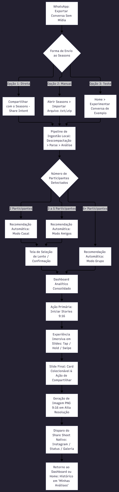
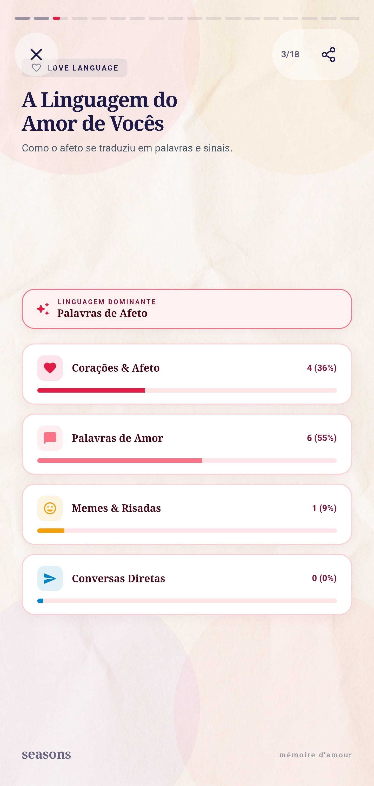

# Seasons — Guia da Jornada do Usuário e Documentação para o Cliente

> **Versão:** 1.0.0  
> **Público-Alvo:** Clientes, Usuários Finais, Product Owners e Avaliadores de Experiência  
> **Tema:** Jornada Completa do Usuário no Aplicativo Seasons (Retrospectiva de Conversas do WhatsApp)  
> **Ecossistema:** Aplicativo Móvel Multiplataforma (Flutter/Dart)

---

## 1. Visão Geral e Proposta de Valor

O **Seasons** é um aplicativo móvel com estética editorial luxuosa que transforma o histórico bruto de conversas exportadas do WhatsApp em uma retrospectiva interativa e visualmente marcante, inspirada no consagrado formato *Spotify Wrapped*.

```
   ┌──────────────────────┐         ┌──────────────────────┐         ┌──────────────────────┐
   │       WHATSAPP       │  Export │       SEASONS        │ Analysis│    STORIES 9:16      │
   │  Conversa Bruta      │────────>│ Processamento Local  │────────>│ Compartilhamento     │
   │  (.txt ou .zip)      │         │ 100% Offline & Seguro│         │ Instagram / Status   │
   └──────────────────────┘         └──────────────────────┘         └──────────────────────┘
```

### O Problema que o Seasons Resolve
O WhatsApp possui mais de 2 bilhões de usuários e disponibiliza nativamente o recurso de **Exportar Conversa**. Contudo, esse arquivo gerado é um bloco de texto puro (`.txt` ou `.zip`), denso, desordenado e praticamente ilegível para uma pessoa comum. Ele é arquivado em e-mails ou pastas esquecidas sem gerar qualquer percepção de valor.

### A Solução Seasons
O Seasons resgata essas memórias e sentimentos. Através de um mecanismo de inteligência analítica determinística local, o app:
1. Higieniza e estrutura as mensagens instantaneamente.
2. Identifica automaticamente a dinâmica social da conversa (romântica, amizade íntima ou grupo coletivo).
3. Apresenta dashboards ricos com métricas reais (frequência, horários de pico, tempos de resposta, vácuos e hábitos de digitação).
4. Constrói uma narrativa audiovisual imersiva em **52 Stories (formato 9:16)** com visual de papel creasado Warm Ivory (`#FBF9F5`), selos de cera e carimbos postais, prontos para compartilhamento no Instagram Stories e WhatsApp Status.

### Pilares de Confiança Inegociáveis
* **100% Offline (Privacidade Absoluta):** O aplicativo não realiza requisições de rede. Nenhum dado, mensagem, áudio ou nome de contato sai do dispositivo do usuário.
* **Sem Paywalls ou Assinaturas:** Todas as métricas, cartões colecionáveis, histórias e recursos analíticos são 100% gratuitos e desbloqueados.
* **Estética Editorial Suíça:** Abandono de interfaces genéricas. O Seasons adota tipografia serifada de alta legibilidade, cantos em squircle contínuo, microanimações a 60 fps e paletas harmônicas com foco em sofisticação.

---

## 2. Personas e Lentes de Análise

O Seasons adapta toda a sua narrativa visual e métricas de acordo com a quantidade de participantes da conversa:

| Lente / Modo | Participantes | Cor Acento | Proposta Emocional & Temática | Destaques da Análise |
| :--- | :---: | :---: | :--- | :--- |
| **Modo Casal**<br>*(Mémoire d'Amour)* | **2** | Rose / Coral<br>`#E11D48` | Romantismo, cumplicidade, conexão profunda e celebração da história a dois. | • Índice de Sintonia & Compatibilidade<br>• Love Language (Corações, Emojis, Memes)<br>• Heatmap "A Nossa Hora" (rotina a dois)<br>• Cartão Colecionável: **Passaporte do Casal** |
| **Modo Amigos**<br>*(Squad Indie Zine)* | **3 a 5** | Sky Blue<br>`#2563EB` | Sintonia da resenha, zine independente, provocações bem-humoradas e cumplicidade da turma. | • Arquétipos de Personalidade do Squad<br>• Campeão do Vácuo (*Wanted Poster*)<br>• Podcaster Oficial (áudios intermináveis)<br>• Cartão Colecionável: **Pôster de Festival Indie** |
| **Modo Grupo**<br>*(Gazeta da Comunidade)* | **6 ou mais** | Imperial Violet<br>`#7C3AED` | Broadsheet jornalístico, dinâmicas de multidão, senso de comunidade e premiação coletiva. | • Leaderboard & Pódio 3D dos Membros<br>• Distribuição de Pareto 80/20 de Mensagens<br>• Corujas da Madrugada & Radar de Vibes<br>• Cartão Colecionável: **Certificado Oficial Guilloche** |

---

## 3. Mapa Geral da Jornada do Usuário

A jornada do usuário é desenhada para ser contínua, sem atritos e com feedback em tempo real a cada interação:



---

## 4. Etapas Detalhadas da Experiência do Usuário

---

### Etapa 0: O Preparo no WhatsApp (Como Exportar)

Para que a mágica aconteça, o usuário inicia o processo dentro do próprio WhatsApp. O aplicativo Seasons ensina didaticamente este procedimento logo no primeiro acesso e sempre que solicitado:

1. **Acessar a Conversa Desejada:** Abra o chat (individual ou grupo) no WhatsApp.
2. **Abrir o Menu de Opções:** Toque no ícone de três pontinhos (**⋮**) no canto superior direito (no Android) ou no nome do contato/grupo no topo (no iOS).
3. **Localizar o Recurso:** Selecione **Mais** e, em seguida, toque em **Exportar conversa**.
4. **Regra de Ouro — "Sem Mídia":** O WhatsApp perguntará se deseja incluir mídias. O usuário deve escolher obrigatoriamente **"Sem mídia"**.
   * *Por que Sem Mídia?* Garante que o arquivo contenha apenas texto, resultando em um processamento instantâneo em milissegundos e consumindo quase zero de espaço em memória.
5. **Resultado:** O WhatsApp gera um arquivo leve com extensão `.txt` ou `.zip` (ex: `Conversa do WhatsApp com Amor.zip` ou `_chat.txt`).

---

### Etapa 1: O Primeiro Contato (Onboarding Editorial de 4 Passos)

Ao abrir o Seasons pela primeira vez, o cliente é recebido por uma experiência fluida de apresentação dividida em quatro páginas elegantes em tons de marfim e serifas modernas:

* **Página 1: Boas-Vindas e Apresentação**
  * *O que o usuário vê:* Apresentação do Seasons como seu arquivo pessoal e sentimental.
  * *Sensação transmitida:* Exclusividade, calma e design editorial refinado.
* **Página 2: O Que o App Faz e os Três Modos**
  * *O que o usuário vê:* Demonstração das três lentes de relacionamento (Casal, Amigos e Grupo) e a promessa dos Stories estilo retrospectiva.
* **Página 3: Guia Passo a Passo Ilustrado**
  * *O que o usuário vê:* Diagrama com os 4 passos exatos para exportar a conversa do WhatsApp sem complicações.
* **Página 4: Garantia Local e Privacidade Inegociável**
  * *O que o usuário vê:* O selo de garantia "100% Local": nenhum servidor, nenhuma conta para criar, zero rastreamento.
  * *Ação:* Botão principal *"Começar a Explorar"* com feedback háptico suave.

> **Persistência Inteligente:** Uma vez visualizado, o onboarding não interrompe mais o usuário nas próximas aberturas. Caso deseje consultá-lo novamente, basta acessar a aba **Configurações > Rever Onboarding**.

---

### Etapa 2: Ingestão de Dados e Processamento em Tempo Real

O cliente possui total liberdade para escolher como levar a conversa para o Seasons:

#### Opção A: Envio Direto via Compartilhamento do WhatsApp (A Mais Rápida)
Logo após clicar em "Exportar conversa > Sem mídia" no WhatsApp, a folha de compartilhamento nativa do sistema abre. O usuário simplesmente toca no ícone do **Seasons**. O aplicativo abre automaticamente e inicia a análise de imediato.

#### Opção B: Importação Manual pelo File Picker na Home
O usuário abre o Seasons e, na tela inicial, clica no cartão com contorno squircle tracejado: *"Toque para importar .txt ou .zip"*. O seletor de arquivos do sistema é aberto para que escolha o arquivo salvo.

#### Opção C: Modo de Demonstração (Para quem quer testar na hora)
O Seasons disponibiliza conversas de exemplo reais embutidas. O cliente pode experimentar um clique nos botões:
* *"Mariana & Lucas (Casal)"*
* *"Resenha da Dupla (Amigos)"*
* *"Turma Completa (Grupo)"*

#### Feedback Visual do Processamento (Pipeline Stage Indicator)
Durante a ingestão, o usuário visualiza o progresso segmentado em três fases, evitando incertezas ou sensação de congelamento:
1. **Descompactando:** Extração em cache temporário volátil (caso seja um `.zip`).
2. **Higienizando:** Limpeza de marcas de sistema, tratamento de mensagens multilinha e suporte a múltiplos padrões de data (24h BR e 12h internacional).
3. **Analisando:** Execução dos algoritmos matemáticos determinísticos de contagem, afinidade e sentimentos.

---

### Etapa 3: Seleção Inteligente de Lente (Mode Selection)

Quando a conversa possui 2 participantes, o Seasons abre a tela de seleção destacando a personalização:

* **Selo "Recomendado para esta conversa":** O sistema reconhece o número de membros e insere automaticamente a insígnia sobre o cartão adequado.
* **Cards Bento Expressivos:**
  * O usuário pode visualizar o resumo temático de cada modo, suas paletas de cores exclusivas e a quantidade de slides correspondente.
* **Liberdade de Escolha:** Se for uma conversa entre dois amigos que não formam um casal romântico, o usuário pode selecionar manualmente o **Modo Amigos** com um simples toque, mantendo controle total sobre a narrativa gerada.

---

### Etapa 4: O Dashboard Analítico

Ao confirmar o modo, o cliente entra no **Dashboard da Retrospectiva**. A tela é composta por blocos arquiteturais modulares:

1. **Cabeçalho Editorial:** Identificação da conversa, nomes dos autores envolvidos e período coberto (data inicial até a data final).
2. **Totalizador Monumental com Count-Up:** Contador animado de mensagens totais que cresce gradualmente até o valor final com numerais tabulares que não tremem na tela.
3. **Distribuição de Participação:** Gráfico proporcional evidenciando quem mandou mais mensagens e a porcentagem exata de cada um.
4. **Métricas de Dinâmica Social:**
   * Tempo médio de resposta de cada participante (formatado em segundos, minutos ou horas).
   * Horário de maior pico de atividade ("A Nossa Hora").
   * Dias da semana mais movimentados e sequência recorde de dias conversando consecutivamente.
5. **Chamada Principal:** Botão em destaque *"Ver Stories da Retrospectiva"* com ícone de reprodução e microvibração ao tocar.

---

### Etapa 5: A Experiência em Stories 9:16 (O Clímax da Retrospectiva)

Esta é a fase mais emocionante e compartilhável da experiência. Ao tocar no botão de Stories, a interface assume proporção 9:16 em tela cheia com trilha visual imersiva:




#### Controles por Gestos
* **Avançar:** Toque em qualquer área do lado direito da tela (70% da largura).
* **Voltar:** Toque no lado esquerdo da tela (30% da largura) para rever o slide anterior.
* **Pausar para Ler:** Pressione e segure o dedo na tela (*tap-and-hold*). O temporizador de 5 segundos é congelado enquanto o dedo estiver na tela.
* **Sair da Visualização:** Deslize o dedo para baixo (*swipe-down*) a qualquer instante para fechar suavemente os Stories e retornar ao Dashboard.

#### Exemplos de Slides por Modo

##### No Modo Casal (18 Stories Únicos):
* **Capa Epistolar:** Apresentação elegante com os nomes do casal e selo de cera em relevo.
* **Volume Monumental:** Volume de mensagens, equilíbrio da conversa e média diária.
* **Linguagens do Amor:** Análise em 4 quadrantes (palavras de carinho, corações, memes trocados e presença).
* **Medidor de Sintonia:** Gauge semicircular retrô com pontuação de afinidade de 0 a 100%.
* **Timeline Afetiva:** Linha temporal com marcos dos meses mais marcantes da relação.
* **Top Palavras e Apelidos:** Nuvem tipográfica de palavras mais repetidas.
* **A Nossa Hora:** O horário exato da madrugada ou noite em que a conexão acontece.
* **Áudios no Vácuo:** Representação estilo fita cassete/vinil com minutos totais de áudios escutados.
* **Passaporte do Casal:** Card de encerramento estilo passaporte oficial, carimbado com as datas e estatísticas da união.

##### No Modo Amigos (18 Stories Únicos):
* **Capa Indie Zine:** Estética de fanzine alternativo com carimbo circular.
* **Trading Cards dos Arquétipos:** Definição do papel de cada amigo (O Piadista, O Atrasado, O Filósofo da Madrugada).
* **Medidor de Caos:** Nível de loucura e velocidade das mensagens na resenha.
* **FBI Wanted Poster (Vácuo Histórico):** Cartaz de procurado bem-humorado destacando quem mais ignora mensagens ou some das conversas.
* **Podcaster Oficial:** Homenagem a quem grava áudios de mais de 3 minutos.
* **Pôster de Festival:** Pôster estilo *line-up* de festival de música alternativo com os integrantes da turma.

##### No Modo Grupo (16 Stories Únicos):
* **Capa da Gazeta da Comunidade:** Diagramação estilo primeira página de jornal clássico.
* **Pódio Olímpico 3D:** Medalhas de ouro, prata e bronze para os 3 membros mais participativos.
* **Princípio de Pareto (80/20):** Demonstração gráfica de qual porcentagem de pessoas gera 80% do barulho do grupo.
* **Corujas da Madrugada:** Ranking de quem manda mensagens entre meia-noite e 5h da manhã.
* **Quem Mais Apaga Mensagens:** O "Fantasma do Chat" que envia e deleta mensagens antes que alguém leia.
* **Certificado Comunitário:** Diploma oficial com bordas guilloche atestando a sobrevivência e atividade do grupo.

---

### Etapa 6: Exportação Social e Compartilhamento

No último slide de cada retrospectiva (ou tocando no botão de compartilhamento no topo a qualquer momento), o cliente pode compartilhar seu resultado com seus amigos e seguidores:

1. **Toque no Botão de Compartilhar:** O usuário toca no botão *"Compartilhar Retrospectiva"*.
2. **Renderização em Alta Resolução:** O Seasons processa o cartão final em formato exato para Stories (resolução 1080x1920, proporção 9:16 vertical), sem barras pretas ou distorções.
3. **Abertura do Menu Nativo do Celular:** A folha de compartilhamento nativa (`share_plus`) é exibida com opções imediatas:
   * **Instagram Stories:** Envio direto para os Stories do Instagram.
   * **WhatsApp Status:** Postagem direta no Status do WhatsApp.
   * **Salvar na Galeria:** Armazenamento no álbum de fotos do celular.
   * **Conversas e Grupos:** Envio para a própria conversa que foi analisada.

---

### Etapa 7: Histórico, Modelos e Configurações (Ciclo Contínuo)

O Seasons foi projetado para uso contínuo através da barra de navegação flutuante com efeito de vidro fosco (*frosted glass*):

```
┌──────────────────────────────────────────────────────────────────────┐
│   [ 🏠 Início ]  [ 📈 Análises ]  [ 🗂️ Modelos ]  [ ⚙️ Ajustes ]   │
└──────────────────────────────────────────────────────────────────────┘
```

* **Aba 1 (Início):** Importador rápido, atalho para o tutorial e retrospectivas recentes.
* **Aba 2 (Minhas Análises):** Histórico de todas as conversas já analisadas neste celular. O usuário pode rever qualquer retrospectiva e reabrir os Stories sem precisar importar o arquivo novamente.
* **Aba 3 (Modelos de Análise):** Vitrine detalhada de cada algoritmo (Casal, Amigos e Grupo) com acesso rápido aos testes interativos de demonstração.
* **Aba 4 (Configurações):** Opção de rever o tutorial de exportação do WhatsApp, importar arquivos manualmente, conferir a declaração de privacidade local e limpar dados armazenados.

---

## 5. Perguntas Frequentes do Cliente (FAQ)

### 1. Minhas conversas pessoais ou fotos são enviadas para algum servidor?
**Não.** O Seasons opera sob uma arquitetura puramente local (*offline-first*). Todo o processamento de leitura, cálculo de compatibilidade e geração dos Stories ocorre exclusivamente dentro da memória temporária do seu próprio aparelho celular. Nenhuma informação é transmitida pela internet.

### 2. O aplicativo cobra alguma taxa após visualizar um certo número de stories?
**Não.** O Seasons não possui assinaturas, cobranças ocultas, moedas virtuais ou paywalls. Todos os recursos, métricas profundas e slides colecionáveis são gratuitos e desbloqueados para sempre.

### 3. Por que preciso escolher a opção "Sem Mídia" ao exportar do WhatsApp?
Ao exportar sem mídia, o WhatsApp gera apenas o histórico de mensagens em formato de texto (`.txt` ou `.zip`), pesando apenas alguns kilobytes ou poucos megabytes. Isso permite que a análise do Seasons ocorra em menos de dois segundos e evita ocupar o armazenamento do seu smartphone com vídeos e áudios desnecessários.

### 4. Posso analisar grupos com centenas de pessoas?
**Sim.** O algoritmo do **Modo Grupo** foi dimensionado para processar conversas com milhares de mensagens e múltiplos membros, calculando rankings de liderança, percentuais de participação e o pódio dos membros mais ativos.

### 5. Onde encontro as retrospectivas que já gerei?
Basta abrir o aplicativo Seasons e tocar na segunda aba da barra inferior flutuante: **"Minhas Análises"**. Todas as conversas processadas anteriormente ficam salvas na memória do app para consulta e reexibição imediata dos Stories.

---

## 6. Glossário de Termos do App

* **Lente de Análise:** O conjunto de algoritmos e visual específico aplicado à conversa (Casal, Amigos ou Grupo).
* **Love Language:** Métrica do Modo Casal que classifica as manifestações de afeto em quatro categorias: corações/emojis carinhosos, vocabulário romântico, troca de memes/humor e constância de mensagens.
* **Vácuo:** Intervalo significativo de tempo em que uma mensagem de um autor permaneceu sem resposta pelo outro participante.
* **Podcaster:** Título concedido ao participante com a maior média de envio de mensagens de áudio prolongadas.
* **Passaporte do Casal:** Card colecionável exclusivo do final do Modo Casal contendo os marcos mais expressivos do relacionamento.
* **Pareto 80/20:** Estatística do Modo Grupo que demonstra graficamente quantos membros foram responsáveis por 80% de todas as mensagens trocadas.
* **Share Intent:** Mecanismo do sistema Android/iOS que permite enviar um arquivo diretamente de um app (como WhatsApp) para outro (como Seasons) pelo menu "Compartilhar".

---